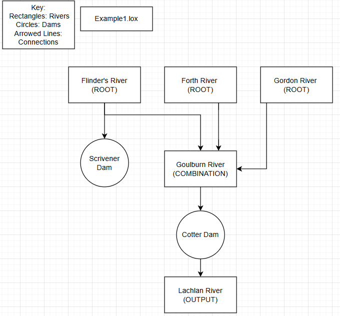
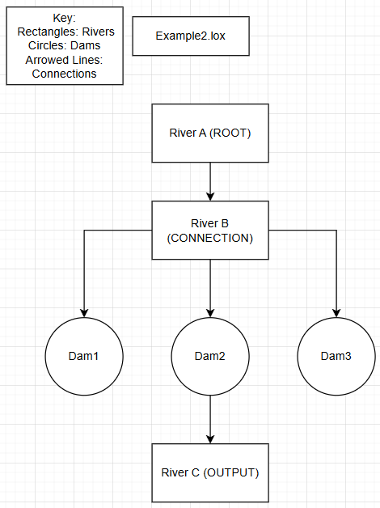
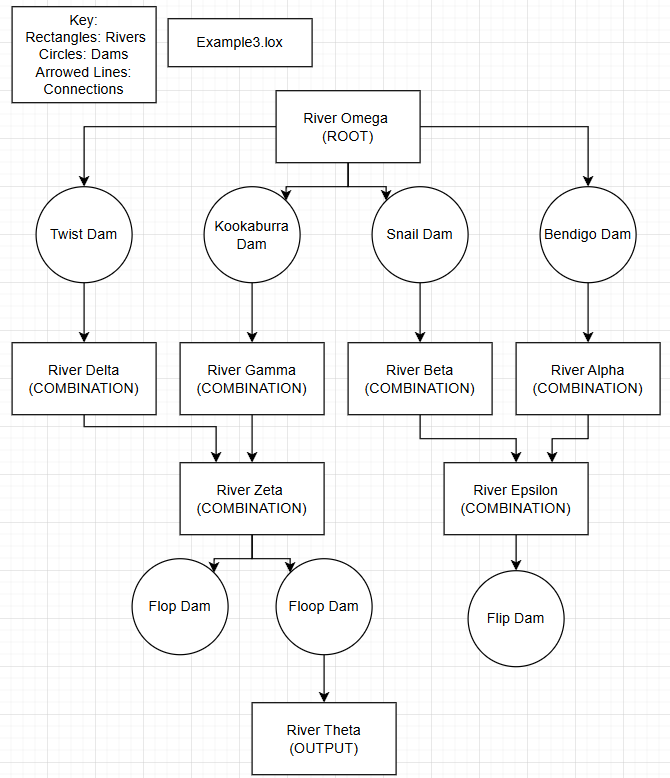

# SID: 47865377
# Name: Matthew Al-Khoury

[Table A](TableA.md)

## Example Programs

* Example programs 1-3 are found within the com/craftinginterpreters/Examples folder found within.

Example 1:


Example 2:


Example 3:



## Compiling and Running:

* To Compile, run the command 
```bash
javac com/craftinginterpreters/Assignment1/*.java
```

* To Run the command;

- Standalone:
```bash
java com/craftinginterpreters/Assignment1/Lox
```
- With Example Programs:
```bash
java com/craftinginterpreters/Assignment1/Lox com/craftinginterpreteres/Examples/Example[n].lox

// remove the "[]" and "n" can be any number from 1-3. ie, Example1.lox
```

## Language Explanation:

* Language based off the Lox language, inherimtly based primarily off Java.
* added Stmt objects, "River", "Dam", and "FlowSpeed" used to associate rivers and dams to program specific bounds, aswell, rate of transfer rivers/dams are moving rainfall. ie. cm/s, mm/s, mm/h, etc.
* Roots off of Nystom but ultimately expends with a few extra statements and declaration types.

## Grammar Rules
```
program        → declaration* EOF ;

declaration    → varDeclaration
               | riverDeclaration
               | damDeclaration
               | statement ;

varDeclaration → "var" IDENTIFIER ( "=" expression )? ";" ;
riverDeclaration → "River" IDENTIFIER "=" expression ";" ;
damDeclaration   → "Dam" IDENTIFIER "=" expression ";" ;
timeUnitDeclaration → "TimeUnits" IDENTIFIER "=" expression ";" ;

statement      → printStatement
               | expressionStatement
               | block ;

printStatement → "print" expression ";" ;
expressionStatement → expression ";" ;
block          → "{" declaration* "}" ;

expression     → assignment ;

assignment     → IDENTIFIER "=" assignment
               | connection ;

connection     → equality ( "->" equality )* ;

equality       → comparison ( ( "!=" | "==" ) comparison )* ;
comparison     → term ( ( ">" | ">=" | "<" | "<=" ) term )* ;
term           → factor ( ( "-" | "+" ) factor )* ;
factor         → unary ( ( "/" | "*" ) unary )* ;
unary          → ( "!" | "-" ) unary
               | primary ;

primary        → "true" | "false" | "nil"
               | NUMBER | STRING
               | IDENTIFIER
               | "(" expression ")"
               | constructor ;

constructor    → "new" classType "(" args ")" ;

classType      → "River" | "Dam" ;

args           → riverArgs | damArgs ;

riverArgs      → STRING "," STRING "," STRING "," STRING "," "{" stringList? "}" ;
damArgs        → STRING "," STRING "," STRING "," STRING ;
timeUnitArgs → STRING "," INTEGER ;

stringList     → STRING ( "," STRING )* ;
```

## Team Operations:

* My team and I worked very well throughout the first half of the semester, every week there would be team discussions on how we could apply solutions to the weekly tasks that were given to us. Throughout weeks 5-8, we were given tasks that allowed us to get a basic grasp on how we were meant to finish this assignment. The group and I came up with language semantics with what was needed and what we could add/remove/not implement at all for each of our own language interpretations. The general idea of having seperate 'classes' (statements and declarations) partially came from an extension of an idea that was discussed together.